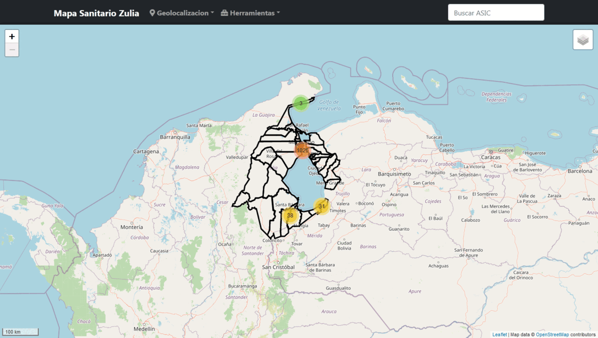

# Mapa Zulia
_Plantilla  de diseño web adaptable  (del ingles <i>responsive web design</i>) 
para crear aplicaciones de mapas web._

## Overview :eye_speech_bubble:



## Framework
- Bootstrap 5
- Leaflet JS

## Instalación
Clonar proyecto
```
	git clone https://github.com/juanfernandez2306/mapa_zulia.git
```
descargar fotos de los establecimientos de salud y descomprimir en la carpeta del proyecto
```
	https://drive.google.com/file/d/1qUCd3K79VdLJchaMjfwF80DDyUfmrFKE/view?usp=sharing
```
- Crear una base de datos MySQL con codificación UTF-8
- Nombre de la base de datos <i>mapa_zulia</i>
- Cargar script sql/bd.sql
- Cargar script sql/establecimientos_salud.sql
- De ser necesario modificar parametros de conexión bd en assets/php/funciones.php

## Contactos
- Twitter : https://twitter.com/juancho_2306

## Licencia
Este proyecto está bajo la Licencia [MIT](/LICENSE) - mira el archivo [LICENSE.md](LICENSE.md) para detalles
